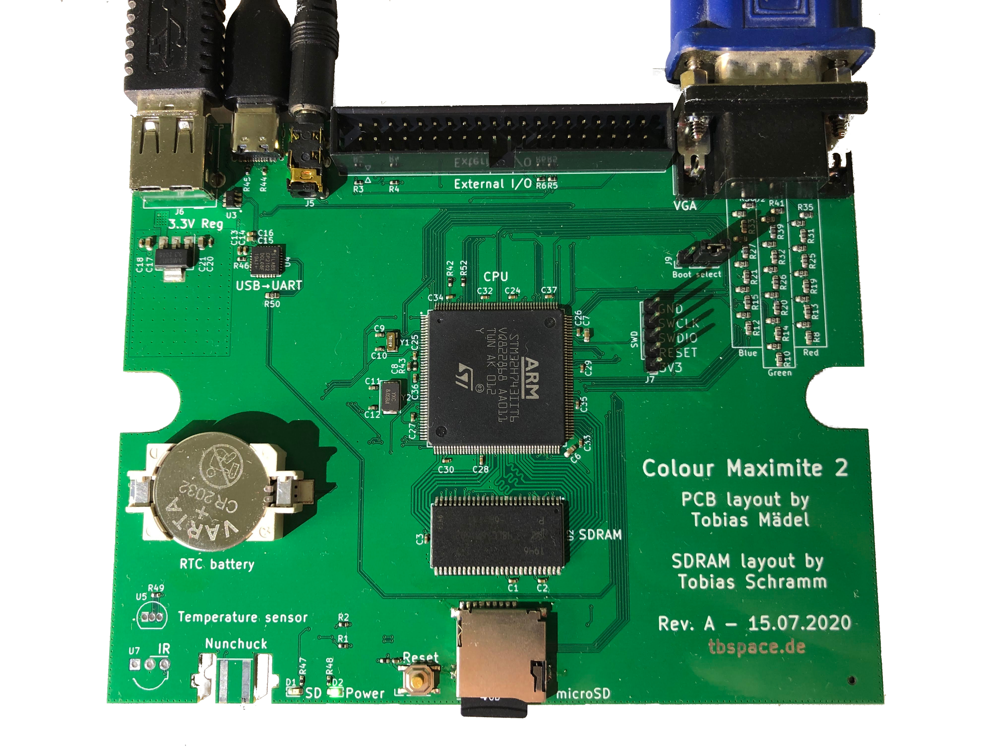

Colour Maximite 2 - JLC-ready design
=============================

#### Overview

This is a open-source hardware clone PCB of the [Colour Maximite 2](https://geoffg.net/maximite.html) computer.  
It's fully compatible to the original firmware and software.  

- Designed for automated assembly at [JLCPCB](https://jlcpcb.com), everything except the connectors can be machine assembled.  
- USB-C port (instead of USB-B) for serial and power  
- microSD socket instead of full-size SD socket  
- STM32 and SDRAM directly onboard, no expensive evaluation board needed  

#### Bill of materials

[Interactive BOM](https://tbspace.de/content/downloads/ibom_cmm2_reve.html)

| Description | Part No.  | Links  |
| :-------:|-------------| -----:|
| 3.5mm audio jack | XKB PJ-3270 | [LCSC](https://lcsc.com/product-detail/Audio-Video-Connectors_XKB-Connectivity-PJ-3270_C381134.html) |
| microSD socket | HOAUC HYC77-TF09-200 | [LCSC](https://lcsc.com/product-detail/Card-Sockets-Connectors_HOAUC-HYC77-TF09-200_C341092.html)  |
| USB-C connector | Jing C167321 | [LCSC](https://lcsc.com/product-detail/USB-Connectors_Jing-Extension-of-the-Electronic-Co-C167321_C167321.html)  |
| USB-A connector | Jing C42650 | [LCSC](https://lcsc.com/product-detail/USB-Connectors_Jing-Extension-of-the-Electronic-Co-C42650_C42650.html)  |
| 40pin IDC | BOOMELE C9138 | [LCSC](https://lcsc.com/product-detail/IDC-Connectors_BOOMELE-Boom-Precision-Elec-C9138_C9138.html)  |
| VGA connector | CONNFLY DS1038-15FBNSiA74-0CC | [LCSC](https://lcsc.com/product-detail/D-Sub-Connectors_CONNFLY-Elec-DS1038-15FBNSiA74-0CC_C75754.html)  |

#### Footprint credits
| Author | Components  |
| ----- |-------|
| [Tobias Schramm](https://github.com/TobleMiner) | CR2032 Holder, 3.5mm Audiojack, MicroSD socket, reset button |
| [Jan Henrik Hemsing](https://github.com/Jan--Henrik) | Nunchuck connector |

#### Rev.A Errata
- Missing mounting holes
- SDRAM pinout is missing A12 line 
(causes instability, fixed in Rev.B, workaround with enamelled copper wire of the same length as the other traces)
- SRV05 diode package had the Pin 1 indicator at Pin 6.  
- Nunchuck footprint is reversed

#### Rev. B Errata
- KiCad Bug caused data corruption in PCB files, board files were reset back to pre-RevA state (missing via stitching). Will still work. 
- SRV05 diode package had the Pin 1 indicator at Pin 6.  
- Nunchuck footprint is reversed

#### Rev. C Errata
- SRV05 diode package had the Pin 1 indicator at Pin 6.  
- Nunchuck footprint is reversed

#### Rev. D Errata
- SRV05 diode package had the Pin 1 indicator at Pin 6.  
